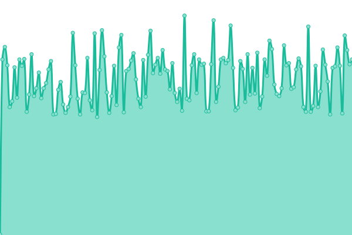

# [📈 Live Status](https://status.erpya.com): <!--live status--> **🟧 Partial outage**

This repository contains the open-source uptime monitor and status page for [E.R.P Consultores y Asociados, C.A](https://status.erpya.com), powered by [Upptime](https://github.com/upptime/upptime).

With [Upptime](https://upptime.js.org), you can get your own unlimited and free uptime monitor and status page, powered entirely by a GitHub repository. We use [Issues](https://github.com/erpcya/status/issues) as incident reports, [Actions](https://github.com/erpcya/status/actions) as uptime monitors, and [Pages](https://status.erpya.com) for the status page.

<!--start: status pages-->
<!-- This summary is generated by Upptime (https://github.com/upptime/upptime) -->
<!-- Do not edit this manually, your changes will be overwritten -->
<!-- prettier-ignore -->
| URL | Status | History | Response Time | Uptime |
| --- | ------ | ------- | ------------- | ------ |
|  Semilla | 🟩 Up | [semilla.yml](https://github.com/erpcya/status/commits/HEAD/history/semilla.yml) | 

 290ms
     
 | 

<a href="https://status.erpya.com/history/semilla">100.00%</a>
    

|  Template | 🟩 Up | [template.yml](https://github.com/erpcya/status/commits/HEAD/history/template.yml) | 

 279ms
     
 | 

<a href="https://status.erpya.com/history/template">100.00%</a>
    

|  Demo ERP | 🟩 Up | [demo-erp.yml](https://github.com/erpcya/status/commits/HEAD/history/demo-erp.yml) | 

 320ms
     
 | 

<a href="https://status.erpya.com/history/demo-erp">100.00%</a>
    

|  Demo ERP (Vue) | 🟩 Up | [demo-erp-vue.yml](https://github.com/erpcya/status/commits/HEAD/history/demo-erp-vue.yml) | 

 191ms
     
 | 

<a href="https://status.erpya.com/history/demo-erp-vue">100.00%</a>
    

|  ERP | 🟩 Up | [erp.yml](https://github.com/erpcya/status/commits/HEAD/history/erp.yml) | 

 286ms
     
 | 

<a href="https://status.erpya.com/history/erp">100.00%</a>
    

|  Prosein | 🟩 Up | [prosein.yml](https://github.com/erpcya/status/commits/HEAD/history/prosein.yml) | 

 284ms
     
 | 

<a href="https://status.erpya.com/history/prosein">100.00%</a>
    

|  CID Invest Corp | 🟩 Up | [cid-invest-corp.yml](https://github.com/erpcya/status/commits/HEAD/history/cid-invest-corp.yml) | 

 289ms
     
 | 

<a href="https://status.erpya.com/history/cid-invest-corp">100.00%</a>
    

|  CID Invest Corp (Vue) | 🟩 Up | [cid-invest-corp-vue.yml](https://github.com/erpcya/status/commits/HEAD/history/cid-invest-corp-vue.yml) | 

 171ms
     
 | 

<a href="https://status.erpya.com/history/cid-invest-corp-vue">100.00%</a>
    

|  ERP Administración | 🟩 Up | [erp-administracion.yml](https://github.com/erpcya/status/commits/HEAD/history/erp-administracion.yml) | 

 275ms
     
 | 

<a href="https://status.erpya.com/history/erp-administracion">100.00%</a>
    

|  El Criollito | 🟩 Up | [el-criollito.yml](https://github.com/erpcya/status/commits/HEAD/history/el-criollito.yml) | 

 261ms
     
 | 

<a href="https://status.erpya.com/history/el-criollito">66.77%</a>
    

|  Industrias BJT | 🟥 Down | [industrias-bjt.yml](https://github.com/erpcya/status/commits/HEAD/history/industrias-bjt.yml) | 

 271ms
     
 | 

<a href="https://status.erpya.com/history/industrias-bjt">70.53%</a>
    

|  HC Import | 🟥 Down | [hc-import.yml](https://github.com/erpcya/status/commits/HEAD/history/hc-import.yml) | 

 277ms
     
 | 

<a href="https://status.erpya.com/history/hc-import">64.79%</a>
    

|  Vealca | 🟥 Down | [vealca.yml](https://github.com/erpcya/status/commits/HEAD/history/vealca.yml) | 

 273ms
     
 | 

<a href="https://status.erpya.com/history/vealca">67.50%</a>
    

|  Los Tres Grandes | 🟩 Up | [los-tres-grandes.yml](https://github.com/erpcya/status/commits/HEAD/history/los-tres-grandes.yml) | 

 259ms
     
 | 

<a href="https://status.erpya.com/history/los-tres-grandes">66.19%</a>
    

|  Nino | 🟥 Down | [nino.yml](https://github.com/erpcya/status/commits/HEAD/history/nino.yml) | 

 253ms
     
 | 

<a href="https://status.erpya.com/history/nino">66.41%</a>
    

|  La Especial | 🟥 Down | [la-especial.yml](https://github.com/erpcya/status/commits/HEAD/history/la-especial.yml) | 

 335ms
     
 | 

<a href="https://status.erpya.com/history/la-especial">65.93%</a>
    

<!--end: status pages-->

[**Visit our status website →**](https://status.erpya.com)

## 📄 License

- Powered by: [Upptime](https://github.com/upptime/upptime)
- Code: [MIT](./LICENSE) © [E.R.P Consultores y Asociados, C.A](https://status.erpya.com)
- Data in the `./history` directory: [Open Database License](https://opendatacommons.org/licenses/odbl/1-0/)
